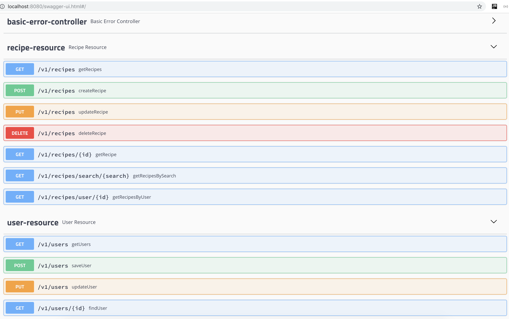
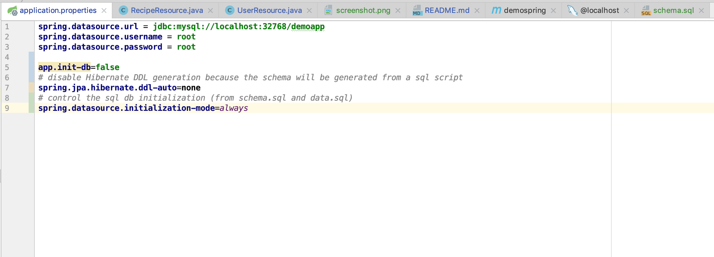

# demoapp

# Instalation

1. Create database (MySQL) with the same name `demoapp` or change too in the application properties
ad¡nd set `url` and the `username` and `password` finally the `port`

# Run the application 
 Open the project with Intellij or your prefer IDE to spring boot and run the project
 and open the browser the url `http://localhost:8080/swagger-ui.html#/`